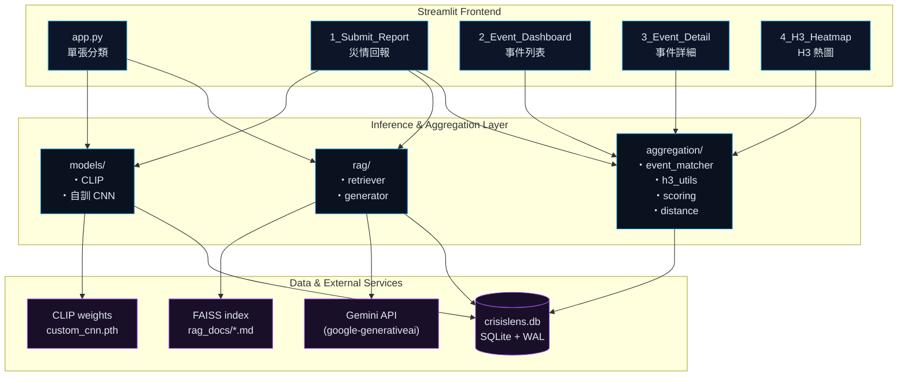
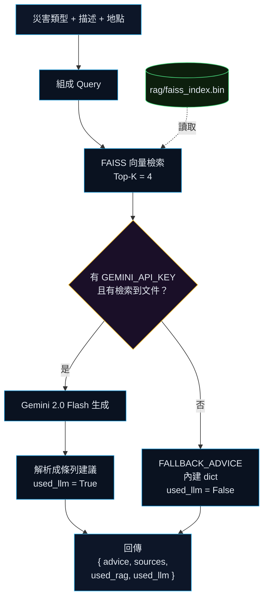
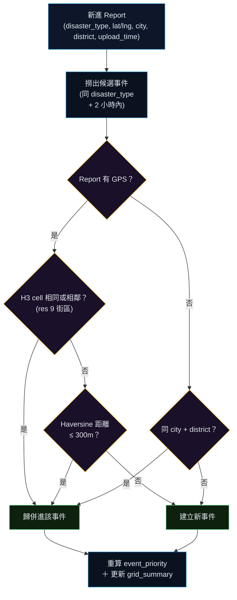

# CrisisLens 🔍

> **災情圖文分類與應變建議系統**
> 上傳一張災情照片，系統自動辨識災害類型、彙整為事件、產生應變建議，並在 H3 地理網格上呈現災情熱度。
>
> CLIP Zero-Shot ＋ 自訓 CNN (4-block, Val Acc 90.51%) ＋ RAG (FAISS + Gemini) ＋ H3 地理聚合

---

## 目錄

- [專案特色](#專案特色)
- [系統架構](#系統架構)
- [專案結構](#專案結構)
- [快速開始](#快速開始)
- [環境變數](#環境變數)
- [使用流程](#使用流程)
- [災害類別與 Prompt Set](#災害類別與-prompt-set)
- [模型說明](#模型說明)
- [RAG 應變建議](#rag-應變建議)
- [資料聚合與評分](#資料聚合與評分)
- [資料庫結構](#資料庫結構)
- [自訓 CNN 訓練（Kaggle）](#自訓-cnn-訓練kaggle)
- [MLOps 版本管理](#mlops-版本管理)
- [AI Safety 聲明](#ai-safety-聲明)
- [常見問題](#常見問題)
- [授權](#授權)

---

## 專案特色

| 功能模組 | 說明 |
|---|---|
| **雙模型分類** | CLIP ViT-L/14（zero-shot，免訓練，含 A/B/C/D 多 prompt 版及 E Linear Probe）＋ 自訓 CNN（4-block, 從頭訓練, 6 類 MEDIC） |
| **可切換 Prompt Set** | A 簡短版、B 完整句版、C 社群情境版三組 prompt，可即時比較效果 |
| **RAG 應變建議** | FAISS 向量檢索 6 份防災 SOP 文件 → Gemini 2.0 Flash 生成建議；無 API key 時自動 fallback 至內建指引 |
| **H3 多層次聚合** | 街區（res 9）→ 行政區 → 縣市 三層 fallback，所有回報都能進熱圖 |
| **事件自動聚合** | 同類型 + 同 H3 cell（或鄰近）+ 2 小時內 → 自動歸併為同一事件 |
| **嚴重度評分** | 受傷／受困／道路阻斷／求助人數 → Report 0–100 分；事件再依回報數加權成 Priority |
| **MLOps 版號追蹤** | 每次推論寫入 `model_runs`，記錄 CLIP/自訓 CNN/RAG/規則的版本，便於追溯與重訓 |
| **管理員校正** | `admin_corrections` 表記錄人工修正，可作為未來 retraining 的標註資料 |
| **AI Safety** | 系統明示為「初步參考」，提醒撥打 119/110，不取代官方判定 |

---

## 系統架構



---

## 專案結構

```
CrisisLens/
├── app.py                            # 主頁：單張照片分類 + 即時 RAG 建議
├── seed.py                           # 寫入固定測試資料（供組員共用）
├── crisislens.db                     # SQLite 資料庫（已隨專案附上初始資料）
├── run.ps1                           # Windows 一鍵啟動腳本（venv + streamlit）
├── train_custom_cnn_kaggle.ipynb     # 自訓 CNN 訓練 notebook（Kaggle GPU 用）
├── requirements.txt
├── .env.example
├── .gitignore
│
├── pages/                     # Streamlit 多頁面（自動掃描）
│   ├── 1_Submit_Report.py     # 災情回報（含 GPS／手動座標／行政區）
│   ├── 2_Event_Dashboard.py   # 事件列表（多條件篩選）
│   ├── 3_Event_Detail.py      # 事件詳細頁
│   └── 4_H3_Heatmap.py        # H3 多尺度災情熱圖
│
├── models/                              # 影像分類模型
│   ├── clip_classifier.py               # CLIP ViT-L/14 zero-shot（含 A/B/C/D/E 五種策略）
│   ├── custom_cnn_model.py              # DisasterCNN_v1 架構（4-block, 6 類）
│   ├── custom_cnn_classifier.py         # 自訓 CNN 推論模組
│   ├── custom_cnn.pth                   # 訓練好的權重（從 Kaggle 下載，未進 git）
│   ├── custom_cnn_classes.json          # 類別對照（6 類，從 Kaggle 下載，未進 git）
│   └── clip_linear_head.pth             # CLIP Linear Probe 權重（E 策略，768 維→6 類）
│
├── rag/                       # 檢索增強生成
│   ├── build_index.py         # 建立 FAISS index
│   ├── retriever.py           # 向量檢索
│   ├── generator.py           # Gemini 生成 + fallback
│   ├── prompts.py             # System / User Prompt 模板
│   └── faiss_index.bin        # 已建好的索引（隨專案附上）
│
├── rag_docs/                  # 防災 SOP 文件（向量化來源）
│   ├── earthquake_sop.md
│   ├── flood_sop.md
│   ├── fire_sop.md
│   ├── typhoon_sop.md
│   ├── landslide_sop.md
│   └── emergency_guideline.md
│
├── aggregation/               # 事件聚合 & 評分
│   ├── h3_utils.py            # H3 網格工具（res 5–9 多尺度）
│   ├── distance.py            # Haversine 距離
│   ├── event_matcher.py       # 同類型 + 同 cell + 2hr → 同事件
│   └── scoring.py             # Report / Event 嚴重度評分
│
├── db/                        # 資料層
│   ├── schema.sql             # 5 張表 schema
│   ├── database.py            # 連線 / init / 遷移
│   └── queries.py             # CRUD 查詢
│
├── utils/
│   ├── config.py              # 類別、Prompt Set、模型路徑、超參數
│   ├── versions.py            # MLOps 版本常數（每次模型更新時遞增）
│   ├── image_utils.py
│   ├── ui_theme.py            # 共用深色主題
│   └── metrics.py
│
├── docs/
│   ├── training_summary.md             # 自訓 CNN 訓練實驗報告（含 ablation 對比）
│   └── superpowers/                    # spec / plan 設計文件（內部開發紀錄）
│
└── outputs/
    └── resnet_training_curve.png       # （ResNet 訓練曲線，未啟用時為舊版產出）
```

---

## 快速開始

### 1. 環境需求

- **Python 3.10+**（建議 3.10 / 3.11，FAISS / sentence-transformers 相容性最佳）
- **OS**：Windows / macOS / Linux 皆可
- **GPU**：非必要。有 CUDA 會自動使用，無 GPU 也能在 CPU 跑（CLIP 推論單張約 1–3 秒）
- **磁碟**：模型檔案＋向量索引約 1.5 GB

### 2. 安裝步驟

```bash
# 1. 取得專案
git clone <your-repo-url>
cd CrisisLens

# 2. 建立虛擬環境
python -m venv venv
# Windows
venv\Scripts\activate
# macOS / Linux
source venv/bin/activate

# 3. 安裝套件
pip install -r requirements.txt

# 4. 設定 API Key（選填，未填則 fallback 至內建建議）
cp .env.example .env
# 編輯 .env，填入 GEMINI_API_KEY

# 5. 建立 FAISS 向量索引（首次必要 / 防災文件有變動時重建）
python rag/build_index.py

# 6.（可選）寫入固定測試資料
python seed.py --reset

# 7. 啟動 Streamlit
streamlit run app.py

# Windows 使用者也可以用一鍵腳本（自動啟 venv + streamlit）：
# .\run.ps1
```

預設網址：<http://localhost:8501>

---

## 環境變數

`.env` 檔案（複製自 [.env.example](.env.example)）：

| 變數 | 必填 | 說明 |
|---|---|---|
| `GEMINI_API_KEY` | 否 | Google Gemini API key，未填寫會自動 fallback 至 [rag/prompts.py](rag/prompts.py) 的 `FALLBACK_ADVICE`。取得：<https://aistudio.google.com/> |

---

## 使用流程

### 流程 A：單張照片快速分類（[app.py](app.py)）

1. 側邊欄選擇模型模式（CLIP / 自訓 CNN / 兩者比較）
2. 上傳災情照片（JPG / PNG / WEBP）
3. 點擊「🚀 開始分析」
4. 系統輸出：
   - **Top-1 分類**（中文標籤、信心度進度條）
   - **Top-3 候選類別**
   - **RAG 應變建議**（標示來源：📚 RAG 檢索 / ✨ Gemini LLM / 📋 內建指引）

### 流程 B：完整災情回報（[pages/1_Submit_Report.py](pages/1_Submit_Report.py)）

1. **取得位置**：
   - 🛰️ 手動輸入 GPS 座標
   - 🗺️ 輸入縣市 + 行政區
   - 📡 自動偵測（瀏覽器 GPS，需安裝 `streamlit-js-eval`）
2. **上傳照片** + 補充描述
3. **填寫災情資訊**：是否有人受困／受傷、道路是否阻斷、人數估計
4. 系統自動：
   - CLIP 推論（信心度 < 0.5 標記 `need_review`）
   - 計算 `report_severity_score`
   - 透過 H3 cell（或縣市行政區）尋找候選事件
   - 同類型 + 2 小時內 → 聚合進現有事件；否則新建事件
   - 重算 `event_priority_score` 與 `grid_summary`
   - 寫入 `model_runs`（含所有版號）
5. 即時呈現 RAG 應變建議

### 流程 C：事件管理（[pages/2_Event_Dashboard.py](pages/2_Event_Dashboard.py) / [3_Event_Detail.py](pages/3_Event_Detail.py)）

- 多條件篩選：災害類型 / 縣市 / 優先級 / 狀態
- 點擊事件 → 進入詳細頁：所有 reports 縮圖、地圖、可信度評等
- 狀態切換：`pending_review` → `verified` → `closed`

### 流程 D：地理熱圖（[pages/4_H3_Heatmap.py](pages/4_H3_Heatmap.py)）

- pydeck 渲染六邊形格網
- 隨地圖縮放等級切換 H3 解析度（5 縣市 → 9 街區）
- 顏色深度對應 `max_priority_score`
- 點擊 cell 顯示主要災害類型、回報數、最近時間

---

## 災害類別與 Prompt Set

### 中英對照（[utils/config.py](utils/config.py)）

| index | 英文 (CLIP 輸出 + 自訓 CNN 類別) | 中文 (顯示用) |
|---|---|---|
| 0 | Earthquake Damage | 地震或建築損壞 |
| 1 | Flood | 淹水 |
| 2 | Fire | 火災 |
| 3 | Typhoon or Storm Damage | 颱風或強風災損 |
| 4 | Landslide | 土石流或坍方 |
| 5 | Other or No Disaster | 其他或無明顯災害 |

> 採 6 類體系，對齊 MEDIC（QCRI/MEDIC）資料集的 `disaster_types`，MEDIC 的 7 個原始標籤透過 `MEDIC_MAP` 映射至此 6 類（`not_disaster` 與 `other_disaster` 合併為類別 5）。

### 三組 Prompt Set

| Set | 風格 | 範例 |
|---|---|---|
| **A 簡短版** | 單字標籤 | `"flood"` |
| **B 完整句版**（預設） | 自然語句 | `"a photo of a flooded street after heavy rain"` |
| **C 社群情境版** | 模擬社群貼文 | `"a social media photo showing flood damage after heavy rainfall"` |

> Prompt Set 切換不需重新載入模型，可現場比較對同一張照片的辨識差異。

---

## 模型說明

### CLIP ViT-L/14（主分類器）

- 來源：OpenAI [openai/CLIP](https://github.com/openai/CLIP)
- **Zero-shot**：不需訓練，靠 prompt 與圖片做相似度比對
- 推論流程：
  1. 圖片過 image encoder → image features
  2. 6 個類別 prompt 過 text encoder → text features
  3. cosine similarity → softmax → 取 Top-3
- 信心度 < `CLIP_LOW_CONF_THRESHOLD`（預設 0.5）會標記 `need_review = 1`

### 自訓 CNN（DisasterCNN_v1）

從頭設計、Kaggle GPU 訓練的 4-block CNN，以 MEDIC（QCRI）資料集訓練 6 類：

```
Conv(3→32) + BN + ReLU + MaxPool
Conv(32→64) + BN + ReLU + MaxPool
Conv(64→128) + BN + ReLU + MaxPool
Conv(128→256) + BN + ReLU + MaxPool
AdaptiveAvgPool(1) + Flatten + Dropout(0.3) + Linear(256, 6)
```

| 指標 | 值 |
|---|---|
| 參數量 | 390,406 |
| 類別數 | 6（地震/淹水/火災/颱風/土石流/其他或無災害） |
| 資料集 | MEDIC（QCRI/MEDIC，HuggingFace） |
| 訓練平台 | Kaggle Notebook (GPU T4) |
| 訓練時間 | ~10-15 分鐘 |

- 架構定義：[models/custom_cnn_model.py](models/custom_cnn_model.py)（單一真實來源）
- 推論模組：[models/custom_cnn_classifier.py](models/custom_cnn_classifier.py)（介面與 `clip_classifier` 對齊）
- 權重檔 `models/custom_cnn.pth` + `models/custom_cnn_classes.json` **未提交至 git**，需執行 Kaggle notebook 後下載放入（見[下方訓練章節](#自訓-cnn-訓練kaggle)）
- 若權重不存在 UI 會標示 ⚠️
- 詳細實驗報告與 ablation 比較：[docs/training_summary.md](docs/training_summary.md)

---

## CLIP Prompt Set 選項（A～E）

分析頁第二層下拉可選擇 CLIP 的分類策略：
- **A 簡短版 / B 詳細版 / C 情境版**：以不同 prompt 文字做 zero-shot 比對。
- **D 多描述投票**：每類用多句描述取平均相似度後投票（`MULTI_PROMPT_SETS`）。
- **E Linear Probe**：載入 `models/clip_linear_head.pth`（在 MEDIC 6 類上訓練的線性分類頭，輸入 768 維 CLIP 特徵），準確率最高。

### 權重與特徵檔取得
- `models/clip_linear_head.pth`：CLIP Linear Probe 權重（隨 repo 提供 / 或由 `notebooks/clip_linear_probe_medic.ipynb` 重訓）。
- `features/*.npz`：CLIP 特徵快取，已列入 `.gitignore`，需自行用 notebook 產生。
- ViT-L/14 首次使用會自動下載（較大），請確認環境資源。

---

## RAG 應變建議

### 流程（[rag/generator.py](rag/generator.py)）



### 向量模型

- Embedding：`paraphrase-multilingual-MiniLM-L12-v2`（支援中文）
- 索引：FAISS `IndexFlatL2`
- 切塊：固定 400 字元、overlap 80 字元
- Top-K：4

### SOP 文件來源

[rag_docs/](rag_docs/) 共 6 份 Markdown：
- `earthquake_sop.md`、`flood_sop.md`、`fire_sop.md`、`typhoon_sop.md`、`landslide_sop.md`
- `emergency_guideline.md`（通用緊急應變）

> 修改 SOP 文件後請重跑 `python rag/build_index.py`，並依約定遞增 [`RAG_INDEX_VERSION`](utils/versions.py)。

---

## 資料聚合與評分

### 事件聚合規則（[aggregation/event_matcher.py](aggregation/event_matcher.py)）

兩筆 report 被歸併為同一事件，需同時滿足：

1. **災害類型相同**
2. **時間相近**：`upload_time` 間隔 ≤ `TIME_WINDOW_HOURS`（2 小時）
3. **位置相近**（任一條件成立）：
   - H3 cell 相同或相鄰（res 9，街區約 174m）
   - 或 Haversine 距離 ≤ `GEO_THRESHOLD_M`（300 公尺）
   - 或同 city + district（無 GPS 時的 fallback）



### Grid Summary（三層 fallback）

| `grid_type` | `grid_id` 組成 | 用途 |
|---|---|---|
| `h3` | h3 cell（res 9） | 有 GPS 的報案，可進熱圖 |
| `district` | `"{city}_{district}"` | 只填行政區的報案 |
| `city` | `"{city}"` | 連行政區都沒有的最後 fallback |

→ **所有報案都能進入熱圖統計**，不會因缺 GPS 而遺失。

### 嚴重度評分（[aggregation/scoring.py](aggregation/scoring.py)）

**Report 0–100 分**：

| 條件 | 加分 |
|---|---|
| 有人受傷 | +30 |
| 有人受困 | +30 |
| 道路阻斷 | +20 |
| 求救標記 | +10 |
| 報案人數 1–5 / ≥6 | +10 / +20 |
| 災害屬高風險類型 | +15 |
| CLIP 信心度 ≥ 0.8 | +5 |

| 級距 | Level |
|---|---|
| ≥ 70 | **High** 🔴 |
| 40–69 | **Medium** 🟡 |
| 0–39 | **Low** 🟢 |

**Event Priority** 進一步以「最大 report 嚴重度 × 60% + 回報數量加權 + 待協助人數 + 受困/受傷/阻斷標誌」計算（同 0–100 級距）。

---

## 資料庫結構

SQLite 檔：`crisislens.db`（已隨專案附上初始資料，可用 [DB Browser for SQLite](https://sqlitebrowser.org/) 開啟瀏覽）

詳細欄位定義見 [db/schema.sql](db/schema.sql)。共 5 張主要表：

| 表 | 用途 |
|---|---|
| `reports` | 每筆原始回報（圖片路徑、位置、CLIP/自訓 CNN 預測、嚴重度…） |
| `events` | 聚合後的事件（含 priority、credibility、status） |
| `grid_summary` | 三種 grid_type 的網格統計（熱圖讀這張） |
| `model_runs` | 每次推論的版號快照（MLOps 追蹤） |
| `admin_corrections` | 人工修正紀錄（可用作 retraining 標註） |

另保留 `h3_grid_summary` 表作為舊版向下相容（不再寫入）。

---

## 自訓 CNN 訓練（Kaggle）

採用 Kaggle 免費 GPU 訓練，避免本地長時間佔用資源。

### 1. 準備 Kaggle Notebook

- 登入 [kaggle.com](https://www.kaggle.com) → Code → New Notebook
- File → **Import Notebook** → 上傳專案根目錄的 [train_custom_cnn_kaggle.ipynb](train_custom_cnn_kaggle.ipynb)
- 右側 Notebook options：
  - Accelerator → **GPU T4 x2**（或 P100）
  - Internet → **On**

### 2. 確認 Internet 已開啟

notebook 使用 HuggingFace `datasets` 下載 `QCRI/MEDIC`，需要 Kaggle internet on。

### 3. Run All

- 約 30-60 分鐘跑完 4 個變體（v1 baseline + v2/v3/v4 ablation）
- 資料集採 MEDIC（QCRI/MEDIC），7 個 disaster_types → 6 類（MEDIC_MAP）
- 詳細訓練設定與超參數可看 notebook 內 Cell 3（Config）

### 4. 下載權重

從 Kaggle Output 面板下載，放入本地 `models/`：
- `custom_cnn.pth`（~1.5 MB，必要）
- `custom_cnn_classes.json`（類別對照，必要）
- `training_curves.png` / `confusion_matrix.png`（報告素材，可選）

### Ablation 摘要

| 變體 | Val Acc | 設計改動 | 學到的事 |
|---|---|---|---|
| v1 Baseline | **90.51%** | 4-block + BN + GAP + Dropout | 此 dataset 用簡單架構也能高分 |
| v2 No-BN | 89.60% | 拿掉所有 BatchNorm | BN 在此 dataset 上影響邊際（−0.9%） |
| v3 Big-FC | 87.91% | GAP → Flatten + 大 Linear | 資料量夠時即使參數暴增也不嚴重過擬合（−2.6%） |
| v4 Shallow | 83.73% | 只保留 2 個 Conv block | 深度有用但邊際遞減（−6.8%） |

完整實驗紀錄、Confusion Matrix 解讀與 Lessons Learned 見 [docs/training_summary.md](docs/training_summary.md)。

---

## MLOps 版本管理

所有版號集中在 [utils/versions.py](utils/versions.py)，**每次更新對應元件時請手動遞增版號**：

```python
CLIP_MODEL_VERSION       = "clip-vitb32-v1"
CLIP_PROMPT_VERSION      = "B-complete-sentence-v1"
RESNET_MODEL_VERSION     = "resnet50-linear-probe-v1"   # 保留，未來 Partial FT 路線觸發時使用
RAG_INDEX_VERSION        = "faiss-multilingual-minilm-v1"
RAG_PROMPT_VERSION       = "gemini-flash-rag-v1"
AGGREGATION_RULE_VERSION = "h3-district-city-fallback-v2"
PRIORITY_RULE_VERSION    = "severity-weighted-v1"
```

> 未來新增自訓 CNN 版本時，建議加上 `CUSTOM_CNN_VERSION = "disaster-cnn-v1-4block"` 並在推論時記錄。

每次推論都會把版號寫入 `model_runs` 表，配合 `admin_corrections` 可追蹤：
- 哪個版本的模型在哪個時間點做了什麼預測
- 哪些預測被管理員修正過
- 未來 retraining 時可篩出「特定版本 + 已修正」的資料子集

---

## AI Safety 聲明

> ⚠️ **本系統的分類與建議僅供災害資訊整理與初步參考，不代表任何官方災害判定。**
>
> - 若有人員受困、受傷或有立即危險，請**優先撥打 119、110**，或依政府公告行動。
> - RAG 應變建議基於系統整理的防災文件，仍需由使用者與管理者自行判斷適用性。
> - CLIP 信心度 < 0.5 的回報會被標記 `need_review`，待人工確認後才提升 credibility。

UI 已內嵌此提醒，請勿移除（見 [app.py](app.py) 底部 `safety-box`）。

---

## 常見問題

**Q1：第一次跑 `streamlit run app.py` 卡很久？**
A：CLIP 首次推論需下載 ViT-L/14 權重（約 890 MB），快取到 `~/.cache/clip/`。下載完成後即正常。

**Q2：FAISS index 不存在的錯誤？**
A：執行 `python rag/build_index.py` 即可。UI 側邊欄會顯示 ✅/⚠️ 狀態。

**Q3：未設定 `GEMINI_API_KEY` 還能用嗎？**
A：可以，會 fallback 到 [rag/prompts.py](rag/prompts.py) 的 `FALLBACK_ADVICE`，UI 會顯示「📋 內建指引」標籤。

**Q4：資料庫已經有資料，重跑 `seed.py` 會重複嗎？**
A：預設會「新增」測試資料。用 `python seed.py --reset` 會先清空 `reports / events / grid_summary` 再寫入（不動 `model_runs / admin_corrections`）。

**Q5：Windows 下 `streamlit-js-eval` 安裝失敗？**
A：此套件僅用於瀏覽器 GPS 自動偵測，缺少時系統會自動隱藏該選項，可手動輸入座標或行政區。

**Q6：可以加入新災害類別嗎？**
A：可以。需同時更新：
1. [utils/config.py](utils/config.py) 的 `CLASSES_EN / CLASSES_ZH / PROMPT_SETS`
2. 自訓 CNN 重新訓練（類別數會變、`Linear(256, num_classes)` 的最後一層 dim 改變）
3. 新增對應 `rag_docs/<new_type>_sop.md` 並重建 FAISS index
4. 遞增 `CLIP_PROMPT_VERSION` / `CUSTOM_CNN_VERSION` / `RAG_INDEX_VERSION`

**Q7：UI 顯示「⚠️ 自訓 CNN 權重不存在」？**
A：表示 `models/custom_cnn.pth` 缺檔。執行 Kaggle notebook 訓練後，把 `custom_cnn.pth` 與 `custom_cnn_classes.json` 從 Kaggle Output 下載並放入本地 `models/` 即可。

---

## 授權

本專案為學術／教學用途。模型權重、API 服務與防災文件之版權各歸原作者所有：

- CLIP：OpenAI MIT License
- sentence-transformers：Apache 2.0
- Gemini：Google AI Studio Terms of Service
- 防災 SOP 文件：依各原始政府／機構出處標示來源

---

**v2.0** · CLIP ViT-L/14（A/B/C/D/E）+ 自訓 CNN 6 類 (DisasterCNN_v1) + RAG · 2026
