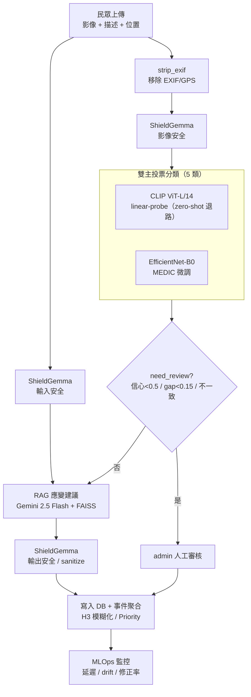

# CrisisLens 🔍

> **災情圖文分類與應變建議系統 v2.1**
> 上傳一張災情照片，AI 自動辨識災害類型、產生防災建議，並將回報聚合為事件、在 H3 地圖上展示災情熱度。
>
> **雙主投票：CLIP ViT-L/14（linear-probe，zero-shot 退路）+ EfficientNet-B0（MEDIC 微調）** · RAG（FAISS + Gemini 2.5 Flash）· ShieldGemma 安全護欄 · H3 地理聚合

---

## 目錄

- [專案特色](#專案特色)
- [系統架構](#系統架構)
- [快速開始（本機 SQLite 模式）](#快速開始本機-sqlite-模式)
- [模型與權重](#模型與權重)
- [環境變數](#環境變數)
- [使用流程](#使用流程)
- [安全與隱私](#安全與隱私)
- [MLOps 版本管理](#mlops-版本管理)
- [專案結構](#專案結構)
- [文件](#文件)
- [Docker 本機測試](#docker-本機測試)
- [Azure 部署](#azure-部署)
- [常見問題](#常見問題)

---

## 專案特色

| 功能模組 | 說明 |
|---|---|
| **雙主投票分類** | CLIP ViT-L/14 與 EfficientNet-B0 兩個獨立主模型對 **5 類災害**投票：一致 → 高信心；不一致 → `need_review` 並取信心較高者 |
| **CLIP 雙路徑** | 預設走 **linear-probe**（舊 6 類 MEDIC head 依類別名稱切片成 5 類，temperature 校準）；權重未就緒時自動退回 **zero-shot 多描述平均** |
| **EfficientNet-B0** | ImageNet backbone + 5 類分類頭，於 QCRI/MEDIC 微調（test **macro-F1 0.8375**）；權重隨 repo 附帶 |
| **need_review 人工審核** | 信心 < 0.50、或 Top-1/Top-2 gap < 0.15、或兩模型不一致 → 標記送 admin 審核 |
| **RAG 防災建議** | FAISS 檢索 6 份防災 SOP → **Gemini 2.5 Flash** 生成；無 API key 自動 fallback 至內建指引 |
| **ShieldGemma 三層安全護欄** | 輸入 / 圖片 / 輸出三檢查點，keyword → Gemini → 本地 ShieldGemma 後端鏈 |
| **EXIF 隱私保護** | `strip_exif()` 於上傳即逐像素重建影像，移除所有 GPS/EXIF |
| **事件自動聚合 v4** | 依災害類型 + 地點距離（≤300m）+ 各類型時間窗口聚合 |
| **H3 多層次熱區圖** | 縣市（res 5）→ 鄉鎮（res 7）→ 街區（res 9）動態縮放 |
| **三維 Priority Score** | Severity × 0.50 + Vulnerability × 0.30 + Credibility × 0.20 |
| **MLOps 版號追蹤** | 每次推論寫入 `model_runs`（含 `inference_latency_ms`），支援 drift 追蹤與 retraining |
| **PostgreSQL / SQLite 雙模式** | 本機 SQLite，Azure 設定 `DATABASE_URL` 自動切換；Azure Blob 圖片儲存可選 |

---

## 系統架構



> 完整的資料卡、模型卡、威脅模型與合規對應，見 [docs/MLSecOps_Final_Report.md](docs/MLSecOps_Final_Report.md)。

---

## 快速開始（本機 SQLite 模式）

### 前置需求

- **Python 3.10 / 3.11**（建議 3.11）
- **Git**
- **磁碟空間**：約 2GB（CLIP ViT-L/14 快取 ~900MB + EfficientNet 權重 16MB + 套件）

### 安裝步驟

```bash
# 1. 取得專案
git clone <your-repo-url>
cd CrisisLens

# 2. 建立虛擬環境
python -m venv venv
# Windows
venv\Scripts\activate
# macOS / Linux
source venv/bin/activate

# 3. 安裝套件（PyTorch CPU-only，大幅縮小安裝量）
pip install torch==2.2.0+cpu torchvision==0.17.0+cpu \
  --index-url https://download.pytorch.org/whl/cpu
pip install -r requirements.txt

# 4. 設定環境變數
cp .env.example .env
# 編輯 .env，填入 GEMINI_API_KEY（選填，未填使用內建指引）

# 5. 建立 FAISS 向量索引
python rag/build_index.py

# 6.（選填）匯入測試種子資料
python seed.py --reset

# 7. 啟動
streamlit run app.py
```

預設網址：<http://localhost:8501>
管理員帳號請透過部署環境變數或初始化腳本建立；**不要在前端或公開文件顯示預設密碼**。

---

## 模型與權重

現役模型的權重**已隨 repo 附帶**，只有 CLIP backbone 需首次自動下載：

| 模型 | 檔案 | 隨 repo | 說明 |
|---|---|---|---|
| CLIP ViT-L/14（encoder） | `~/.cache/clip/ViT-L-14.pt`（~900MB） | 首次自動下載 | zero-shot 與 linear-probe 共用 |
| CLIP linear-probe head | `models/clip_linear_head.pth`（20KB） | ✅ | 舊 6 類 head 切片成 5 類 |
| EfficientNet-B0（5 類微調） | `models/efficientnet_b0_5class_v2.pth`（16MB） | ✅ | 雙主投票第二主，macro-F1 0.8375 |
| 5 類標籤對照 | `models/classes_5class_v2.json` | ✅ | — |
| DisasterCNN_v1（legacy） | `models/custom_cnn.pth` | ❌（選用） | 已從投票淘汰（macro-F1 0.7012） |
| ResNet50 baseline（legacy） | `models/resnet50_linear.pth` | ❌（不在 repo） | 已淘汰，僅留訓練腳本 |

> 缺少 legacy 權重不影響系統運作；雙主投票僅需上方三個已附帶的檔案。
> CLIP linear-probe 若載入失敗，會自動退回 zero-shot 多描述平均（系統不中斷）。

---

## 環境變數

複製 `.env.example` 為 `.env` 後填入：

| 變數 | 必填 | 說明 |
|------|------|------|
| `GEMINI_API_KEY` | 否 | 未填時 RAG 使用內建指引（功能仍可用）；亦用於 ShieldGemma Gemini 後端與 Vision 圖片檢查 |
| `USE_LOCAL_SHIELDGEMMA` | 否 | 設為 `true` 啟用本地 ShieldGemma（`google/shieldgemma-2b`，約 2GB RAM/VRAM） |
| `SHIELDGEMMA_MODEL` | 否 | 覆寫本地 ShieldGemma 模型名稱（預設 `google/shieldgemma-2b`） |
| `DATABASE_URL` | 否（本機） | PostgreSQL 連線字串，未填使用 SQLite |
| `AZURE_STORAGE_CONNECTION_STRING` | 否 | 未填時圖片存 `uploads/reports/` |
| `AZURE_STORAGE_CONTAINER` | 否 | 預設 `crisislens-uploads` |

---

## 使用流程

### 民眾端

1. 登入或註冊帳號
2. 上傳災情照片（JPG / PNG / WEBP；上傳即移除 EXIF/GPS）
3. 選擇定位方式（瀏覽器 GPS / 手動座標 / 行政區）
4. 點擊「AI 辨識並產生建議」→ 右側出現辨識結果 + 防災建議
5. 確認後點擊「送出災情回報」

> GPS 失敗或未填座標時，仍可用行政區送出回報。

### 管理端

1. Admin 帳號登入後自動跳轉到 Event Dashboard
2. 依災害類型、縣市、優先級、狀態篩選事件
3. 點選事件卡進入詳細頁，查看回報照片、地圖與 Admin Corrections
4. 在 H3 熱圖頁觀察全台災情分布
5. 在權限審核頁批准 / 拒絕 admin 申請
6. 在 MLOps 頁監控版本、修正率、待審核率與推論延遲

### 模型選擇（側邊欄）

- **雙主投票 (CLIP linear-probe + EfficientNet-B0)** — 預設
- **CLIP linear-probe** — 單獨
- **CLIP ViT-L/14 (zero-shot)** — 單獨（退路/比較用）
- **EfficientNet-B0** — 單獨

---

## 安全與隱私

> ⚠️ **本系統的分類與建議僅供災害資訊整理與初步參考，不代表任何官方災害判定。**
> 若有人員受困、受傷或有立即危險，請**優先撥打 119、110**。

### ShieldGemma 三層安全護欄

每次「AI 辨識並產生建議」自動執行：

| 後端層 | 觸發條件 | 說明 |
|------|----------|------|
| Layer 1 — Keyword 規則 | 永遠執行 | 比對禁用模式（prompt injection、仇恨、釣魚 URL…），近零延遲 |
| Layer 2 — Gemini API | `GEMINI_API_KEY` 設定時 | 語意分析文字 + Vision 檢查圖片 |
| Layer 3 — 本地 ShieldGemma | `USE_LOCAL_SHIELDGEMMA=true` 時 | `google/shieldgemma-2b` 本地推論（P>0.70 block / >0.40 review） |

**三個檢查點**：使用者描述（`check_user_input`）、上傳圖片（`check_image_safety`）、RAG 建議輸出（`check_rag_output`）。
**結果 label**：`safe` / `review`（送人工審核）/ `sanitize`（替換危險語句）/ `block`（中止）。

### 其他安全控制

- **EXIF/GPS 移除**：`strip_exif()` 於 `load_image()` 逐像素重建影像，GPS 不入庫/不上雲。
- **位置模糊化**：事件聚合以 H3 resolution 9（街區級 ~174m）呈現。
- **供應鏈**：模型權重以 `torch.load(weights_only=True)` 載入（防反序列化攻擊）。
- **認證**：密碼以 PBKDF2-SHA256（120,000 iterations）+ salt 雜湊。
- **限速**：每使用者每小時最多 10 筆回報。
- **need_review**：信心 < 0.50、Top-2 gap < 0.15、或 CLIP ≠ EfficientNet 不一致 → 一律送人工審查。

> 完整威脅模型、MITRE ATLAS / OWASP LLM Top 10 對應、合規對照（NIST/ISO/ETSI），見 [docs/MLSecOps_Final_Report.md](docs/MLSecOps_Final_Report.md) 與 [docs/security_paper.docx](docs/security_paper.docx)。

---

## MLOps 版本管理

版號統一在 [`utils/versions.py`](utils/versions.py)：

```python
CLIP_MODEL_VERSION       = "clip-vitl14-v1"
CLIP_PROMPT_VERSION      = "multi-prompt-avg-5class-v2"
CLIP_PROBE_VERSION       = "linear-probe-medic-6to5-v1"
EFFNET_MODEL_VERSION     = "efficientnet-b0-medic-5class-v2"   # test macro-F1 0.8375
CNN_MODEL_VERSION        = "custom-cnn-medic-5class-v2"        # legacy
RAG_INDEX_VERSION        = "faiss-multilingual-minilm-v1"
RAG_PROMPT_VERSION       = "gemini-flash-rag-v1"
AGGREGATION_RULE_VERSION = "disaster-group-distance-timewindow-v4"
PRIORITY_RULE_VERSION    = "svcp-weighted-v2"
```

每次更新對應元件時遞增版號，所有版號寫入 `model_runs`（CLIP 走 linear-probe 時記 `CLIP_PROBE_VERSION`）。

**Retraining 觸發建議**：`need_review` 率 > 30%（連續 100 筆），或 model agreement 率 < 60%（7 天窗口）。

---

## 專案結構

```
CrisisLens/
├── app.py                      # 主頁：民眾端（災情回報 + AI 辨識 + 安全護欄）
├── seed.py                     # 測試種子資料
├── startup.sh / Dockerfile / requirements.txt / .env.example
│
├── pages/
│   ├── 2_Event_Dashboard.py    # 管理端：事件列表
│   ├── 3_Event_Detail.py       # 管理端：事件詳細（含 Admin Corrections）
│   ├── 4_H3_Heatmap.py         # 管理端：H3 熱區地圖
│   ├── 5_Permission_Review.py  # 管理端：使用者權限審核
│   └── 6_MLOps.py              # 管理端：MLOps 監控
│
├── models/
│   ├── clip_classifier.py            # CLIP：zero-shot 多描述 + linear-probe（6→5 切片）+ classify_clip 入口
│   ├── clip_linear_head.pth          # CLIP linear-probe head（20KB，已附帶）
│   ├── efficientnet_classifier.py    # EfficientNet-B0 推論
│   ├── efficientnet_b0_5class_v2.pth # EfficientNet 權重（16MB，已附帶）
│   ├── classes_5class_v2.json        # 5 類標籤對照
│   ├── custom_cnn_*.py / custom_cnn.pth   # DisasterCNN_v1（legacy）
│   └── resnet_baseline.py / train_resnet.py  # ResNet50 baseline（legacy）
│
├── rag/
│   ├── build_index.py / retriever.py / generator.py   # FAISS 索引 / 檢索 / Gemini 生成
│   └── prompts.py              # RAG system/user prompt + fallback
├── rag_docs/                   # 6 份防災 SOP（zh-TW）
│
├── safety/
│   └── shieldgemma_guard.py    # ShieldGemma 三檢查點安全護欄
│
├── aggregation/                # 事件聚合（event_matcher / h3_utils / scoring / distance）
├── db/                         # schema（SQLite/PG）+ 雙模式連線 + 查詢
├── utils/                      # config / versions / storage / auth / image_utils（strip_exif）/ ui_theme …
│
├── picture/                    # EDA 圖與混淆矩陣（報告用）
└── docs/
    ├── MLSecOps_Final_Report.md  # ★ MLSecOps 期末報告（Data/Model/Prompt Card + Threat Model + Compliance）
    ├── data_card.md / model_card.md / system_card.md
    ├── security_paper.docx       # 資安分析（4 威脅 + 防禦 + 文獻）
    ├── deployment_azure.md
    └── superpowers/specs · superpowers/plans  # 設計規格與實作計畫
```

---

## 文件

| 文件 | 內容 |
|---|---|
| [docs/MLSecOps_Final_Report.md](docs/MLSecOps_Final_Report.md) | 完整 MLSecOps 證據包：Use Case Canvas、Data Card、Model Card、Prompt Card、TEVV、Threat Model、合規對應 |
| [docs/data_card.md](docs/data_card.md) | QCRI/MEDIC 5 類資料卡 |
| [docs/model_card.md](docs/model_card.md) | 雙主投票模型卡 |
| [docs/system_card.md](docs/system_card.md) | 系統流程、聚合規則、安全 |
| [docs/security_paper.docx](docs/security_paper.docx) | 對抗樣本 / RAG 中毒 / prompt injection / EXIF 洩漏分析 |
| [docs/deployment_azure.md](docs/deployment_azure.md) | Azure 部署指南 |

---

## Docker 本機測試

```bash
docker build -t crisislens:local .

# 本機 SQLite + 圖片存容器內
docker run -p 8501:8501 -e GEMINI_API_KEY=你的key crisislens:local

# 掛載本機 DB + uploads
docker run -p 8501:8501 \
  -v "$(pwd)/crisislens.db:/app/crisislens.db" \
  -v "$(pwd)/uploads:/app/uploads" \
  -e GEMINI_API_KEY=你的key crisislens:local
```

---

## Azure 部署

詳見 [docs/deployment_azure.md](docs/deployment_azure.md)。摘要：

```bash
docker build -t crisislensacr.azurecr.io/crisislens:latest .
docker push crisislensacr.azurecr.io/crisislens:latest
az containerapp update --name crisislens --resource-group crisislens-rg \
  --image crisislensacr.azurecr.io/crisislens:latest
```

---

## 常見問題

**Q1：CLIP 首次推論很慢？**
A：ViT-L/14 首次需下載約 900MB，快取後推論正常（約 2–5 秒/張，CPU）。

**Q2：FAISS index 錯誤？**
A：執行 `python rag/build_index.py`。側邊欄顯示 ✅ 表示就緒。

**Q3：結果顯示 linear-probe 還是 zero-shot？**
A：預設走 linear-probe；若 `models/clip_linear_head.pth` 缺失或載入失敗會自動退回 zero-shot，結果區會以 caption 標示實際路徑。

**Q4：H3 地圖無法顯示？**
A：確認已安裝 `h3`。若缺套件，頁面會顯示安裝提示。

**Q5：如何切換 PostgreSQL？**
A：在 `.env` 填入 `DATABASE_URL=postgresql://...` 後重啟。Schema 初始化是冪等的。

**Q6：送出回報後沒看到事件？**
A：可能 GPS 與行政區皆未填（`grid_id = NULL`）。建議至少填入縣市。

**Q7：要跑測試？**
A：`python -m pytest tests/`（涵蓋 CLIP linear-probe 切片/載入/路由/fallback）。

---

**v2.1** · 雙主投票（CLIP linear-probe + EfficientNet-B0）· RAG（Gemini 2.5 Flash）· ShieldGemma · 2026
