# CrisisLens — MLSecOps 期末報告

> **課程**：MLSecOps（AI Security & Safety）
> **專案**：CrisisLens v2.1 — 災情圖文分類與應變建議平台
> **作者**：CrisisLens 專案團隊
> **日期**：2026-06-13

---

## 摘要

CrisisLens 是一套面向災害情境的 AI 平台：民眾上傳災情照片與文字描述，系統以**雙主投票**（CLIP ViT-L/14 linear-probe 與 EfficientNet-B0）將影像分類為 5 類災害，再透過 **RAG（Gemini 2.5 Flash）** 產生在地化應變建議，最後寫入資料庫並做事件聚合與即時監控。由於系統處理公民提交的影像、產生攸關公共安全的建議，本報告以 **MLSecOps 證據包**的形式，完整記錄其資料治理、模型治理、可信度、威脅模型、監控與合規對應。

本報告刻意對齊課程的期末交付包清單，逐項提供可稽核的證據：

| 課程交付物 | 對應章節 |
|---|---|
| AI Use Case Canvas | §1 系統概述 |
| **Data Card** | §2 |
| **Model Card** | §3 |
| **Prompt Card** | §4 |
| Trustworthiness（TEVV） | §5 |
| **Threat Model** | §6 |
| Test Report（監控 / 部署 Gate） | §7 |
| **Compliance Mapping** | §8 |
| 殘餘風險與反思 | §9 |

> 本系統同時涵蓋課程 Workshop 2（隱私保護的視覺安全偵測）與 Workshop 3（企業 RAG 助理）的特性：它既是一個視覺安全事件偵測系統，也是一個帶安全護欄的 RAG 應變助理。

---

## 目錄

1. [系統概述 / AI Use Case Canvas](#1-系統概述--ai-use-case-canvas)
2. [Data Card](#2-data-card)
3. [Model Card](#3-model-card)
4. [Prompt Card](#4-prompt-card)
5. [可信度測試（TEVV）](#5-可信度測試tevv)
6. [威脅模型與資安（Threat Model）](#6-威脅模型與資安threat-model)
7. [MLOps 監控與部署 Gate（Test Report）](#7-mlops-監控與部署-gatetest-report)
8. [合規對應（Compliance Mapping）](#8-合規對應compliance-mapping)
9. [殘餘風險與反思](#9-殘餘風險與反思)

---

## 1. 系統概述 / AI Use Case Canvas

### 1.1 AI Use Case Canvas

| 欄位 | 內容 |
|---|---|
| **問題 / 動機** | 災害發生時，分散的民眾目擊資訊難以即時彙整、分類與分級，影響應變調度。CrisisLens 以 AI 將「一張照片 + 一句描述」轉為「已分類、已分級、附應變建議」的結構化情報。 |
| **主要使用者** | (1) 民眾回報端：上傳災情影像、文字、位置；(2) 管理端（admin）：在儀表板審核、修正、調度，並監控模型效能。 |
| **AI 決策情境** | 影像 → 5 類災害分類（雙主投票）→ 信心/一致性評估 → RAG 應變建議。AI 輸出為**輔助情報**，非自動指揮。 |
| **人類監督（Human-in-the-loop）** | 低信心、模型不一致或模糊樣本標記 `need_review = 1`，進入 admin 人工審核；admin 可修正分類，修正回饋進入 MLOps 追蹤。最終裁量權保留於人。 |
| **風險分級** | 中高風險：輸出影響公共安全與應變資源配置；錯誤分類或誤導建議可能延誤救援。故全程採人類監督 + 安全護欄 + 免責聲明。 |
| **範圍（In-scope）** | 5 類災害影像分類、應變建議生成、事件聚合與優先級、安全/隱私護欄、效能監控。 |
| **非目標（Out-of-scope）** | 不做人臉辨識、不做自動派遣決策、不取代官方災害判定（輸出標示「僅供初步參考，不代表官方災害判定」）。 |
| **成功指標** | 分類 macro-F1（目前 EfficientNet 0.8375）、需審核樣本能被正確攔截、應變建議安全且在地化、端到端延遲可監控。 |

### 1.2 ML 生命週期與各階段控制

CrisisLens 以「每個階段都產生證據與控制」的 MLSecOps 思維貫穿生命週期：

### 1.3 端到端系統架構

下圖為單次回報的執行流程，安全護欄（ShieldGemma）包夾在輸入與輸出兩端，分類採雙主投票，低信心/不一致進入人工審核：

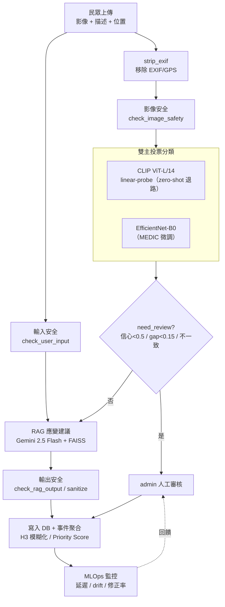

### 1.4 技術組成一覽

| 層 | 元件 | 版本 / 模型 |
|---|---|---|
| 分類（第一主） | CLIP ViT-L/14（linear-probe 優先，zero-shot 退路） | `clip-vitl14-v1` / `linear-probe-medic-6to5-v1` / `multi-prompt-avg-5class-v2` |
| 分類（第二主） | EfficientNet-B0（MEDIC 5 類微調） | `efficientnet-b0-medic-5class-v2`（test macro-F1 0.8375） |
| 應變建議 | RAG：FAISS + MiniLM 檢索 + Gemini 2.5 Flash | `faiss-multilingual-minilm-v1` / `gemini-flash-rag-v1` |
| 安全護欄 | ShieldGemma 三檢查點（輸入 / 影像 / 輸出） | keyword → 本機 ShieldGemma → Gemini |
| 聚合與分級 | H3 (res 9) 事件聚合 + Priority Score | `disaster-group-distance-timewindow-v4` / `svcp-weighted-v2` |
| 監控 | MLOps 儀表板（`model_runs` + `inference_latency_ms`） | — |
| Legacy（已淘汰） | DisasterCNN_v1（0.7012）、ResNet50 baseline | `custom-cnn-medic-5class-v2` |

---

## 2. Data Card

> 本章採課程 Data Card 8 段模板。CrisisLens 涉及兩類資料：**訓練資料（QCRI/MEDIC，固定學術資料集）**與**生產資料（民眾即時回報）**。兩者風險屬性不同，分別說明。

### 2.1 Dataset identity（資料集識別）

| 欄位 | 訓練資料 | 生產資料 |
|---|---|---|
| 名稱 | QCRI/MEDIC（disaster_types split），CrisisLens 5 類 v2 改作 | CrisisLens 民眾災情回報 |
| 擁有者 / 來源 | Qatar Computing Research Institute (QCRI) | CrisisLens 平台使用者 |
| 版本 | 5 類 v2（`models/classes_5class_v2.json`） | 持續累積 |
| 業務目的 | 訓練 5 類災害影像分類器 | 真實災情情報彙整、事件聚合 |

### 2.2 Provenance & licensing（出處與授權）

- **來源**：QCRI/MEDIC，社群媒體影像（Twitter、Flickr）於真實災害事件期間蒐集，群眾標註 + 專家驗證。
- **論文**：Alam et al., *MEDIC: A Multi-Task Learning Dataset for Disaster Image Classification*, ACL 2021 Workshop。
- **下載**：https://crisisnlp.qcit.edu.qa/medic/index.html
- **授權**：Research / Academic 非商業使用 → CrisisLens 屬學術專案，符合授權範圍；**不得商業化部署**為已知限制。
- **領域改作**：MEDIC 原 `hurricane` 改映射為「颱風或強風災損 Typhoon or Storm Damage」以符合台灣用語；訓練影像以大西洋颶風為主，對台灣颱風存在 **distribution shift**（見 §2.6、§5）。

### 2.3 Schema & labels（結構與標籤）

**5 類標籤（`models/classes_5class_v2.json`、`utils/config.py`；已於 v2 移除舊第 6 類「Other or No Disaster」）：**

| idx | English | 中文 |
|---|---|---|
| 0 | Earthquake Damage | 地震或建築損壞 |
| 1 | Flood | 淹水 |
| 2 | Fire | 火災 |
| 3 | Typhoon or Storm Damage | 颱風或強風災損 |
| 4 | Landslide | 土石流或坍方 |

**生產資料每筆回報主要欄位（`db/schema.sql`）**：`image_path`、`latitude/longitude`、`city/district`、`disaster_type`、`clip_confidence`、`need_review`、`model_agreement`、`rag_advice` 等。

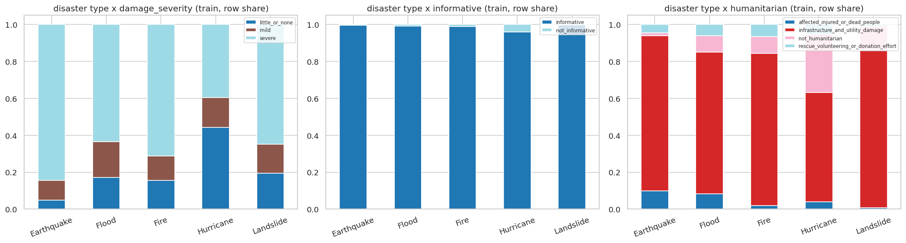
*圖 2-1：MEDIC 多任務標籤交叉分布（disaster type × damage_severity / informative / humanitarian，train）。CrisisLens 僅使用 disaster_types 任務作為分類目標，其餘多任務標籤未納入，但此圖顯示資料集本身的多標籤性質。*

### 2.4 Protected attributes（受保護屬性）

- CrisisLens 的資料**不含人口統計受保護屬性**（性別、年齡、種族等），故不適用 SPD/DI 這類人口公平性指標。
- 改以**任務相關的 slice 維度**做公平性檢視：**災害類別**、**地理區域**、**時段**（詳見 §5 可信度測試）。對應課程「不應盲目移除受保護屬性、需用於測試與監控」的精神，這裡保留 class/region/time 作為持續監控維度。

### 2.5 Privacy controls（隱私控制）

| 風險 | 控制 |
|---|---|
| 影像 EXIF 內含 GPS/裝置資訊 | `strip_exif()`（`utils/image_utils.py`）在任何儲存/推論前以逐像素重建影像，移除所有 EXIF；`load_image()` 每次上傳必呼叫 |
| 回報精確座標暴露使用者位置 | 事件聚合以 **H3 resolution 9（邊長約 174m）**模糊化；座標不對外公開 |
| 影像可能含可識別人物 | 不做人臉辨識，僅用於災害分類；admin-only 存取 |
| 描述文字可能含 PII（身分證/手機/精確地址） | ShieldGemma 輸入檢查標記 review（見 §6） |
| 資料保留 | 目前無自動刪除政策 → 列為未來工作（§9） |

### 2.6 Quality & bias（品質與偏誤）

**訓練集類別分布（`docs/eda_5class_phase1_analysis.md`）：**

| 類別 | Train 張數 | 占比 |
|---|---|---|
| Earthquake Damage | 12,296 | 53.3% |
| Typhoon or Storm Damage（原 Hurricane） | 4,517 | 19.6% |
| Flood | 3,401 | 14.7% |
| Fire | 1,796 | 7.8% |
| Landslide | 1,065 | 4.6% |
| **Train 合計** | **23,075** | 100% |

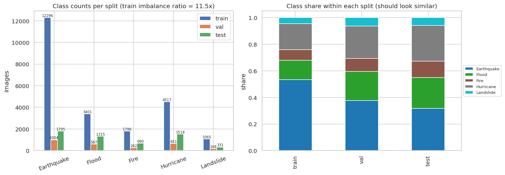
*圖 2-2：各 split 類別張數（左）與類別占比（右）。train 不平衡比 11.5x（Earthquake 12,296 最多、Landslide 1,065 最少）；三個 split 的類別占比相近，無明顯分布偏移。*

- **類別不平衡**：最多/最少 = **11.55x**（Earthquake vs Landslide）→ 訓練以 `val_macro_f1` 選模、輔以資料增強緩解。
- **已知偏誤**：地理偏誤（西半球事件為主，台灣場景準確率下降）、平台偏誤（社群照片）、時間偏誤（2012–2020）、**Hurricane≠Typhoon**（視覺型態差異 → 颱風類 recall 最弱 0.783，見 §3）、Earthquake 主導訓練集。

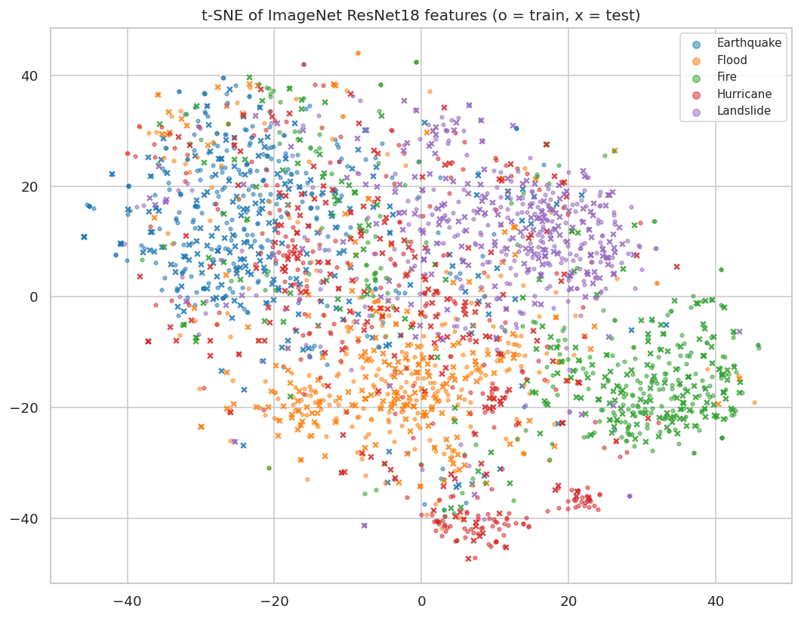
*圖 2-3：ImageNet ResNet18 特徵的 t-SNE 投影（o=train，x=test）。各類有部分群聚，但邊界明顯重疊，顯示僅靠通用預訓練特徵不足以完全分離五類，需微調。*

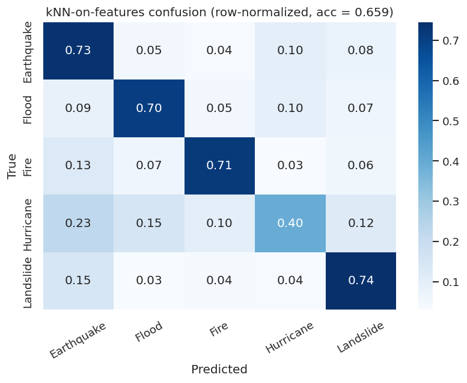
*圖 2-4：kNN-on-features 基線混淆矩陣（row-normalized，acc = 0.659）。**Hurricane/颱風對角僅 0.40**（0.23 被誤判為 Earthquake）為最弱類，早在基線階段即預示後續颱風 recall 偏低（§3 的 0.783）。*

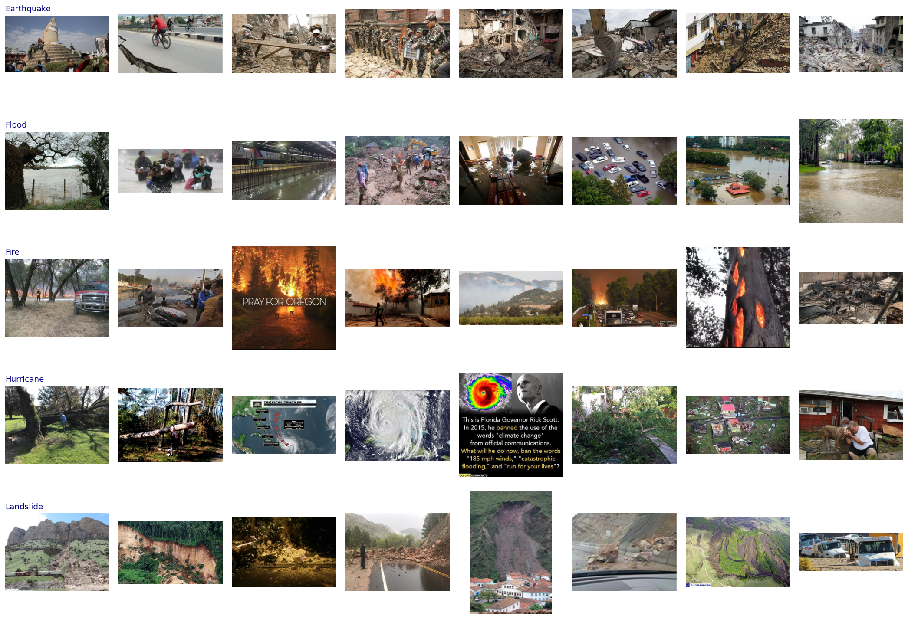
*圖 2-5：各類代表樣本。可見明顯的雜訊／非典型樣本——例如 Hurricane 類含政治迷因文字圖、Fire 類含 "PRAY FOR OREGON" 字卡，屬於社群媒體資料的品質風險，對應 §6 的 data poisoning 與穩健性討論。*

### 2.7 Splits & lineage（切分與血緣）

| Split | 張數 | 用途 |
|---|---|---|
| Train | 23,075 | 訓練 |
| Validation | 2,672 | 選模（macro-F1 最佳 epoch） |
| Test | 5,649 | held-out 最終評估（EfficientNet test macro-F1 **0.8375**） |

**清理 pipeline（`models/classes_5class_v2.json`）**：

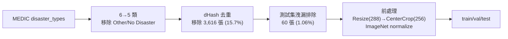

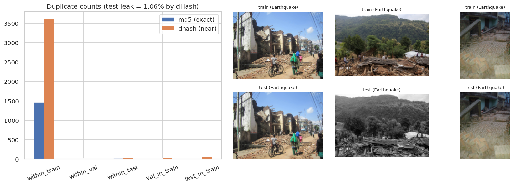
*圖 2-6：重複與洩漏偵測（md5 精確 vs dHash 近重複）。train 內近重複約 3,500+ 張、測試集洩漏 = 1.06%，據此執行去重（−3,616）與測試集洩漏排除（−60），避免評估高估。*

- 增強：RandomResizedCrop scale=[0.5,1.0]、ColorJitter=[0.15,0.15,0.1]；img_size 256；選模指標 `val_macro_f1`。

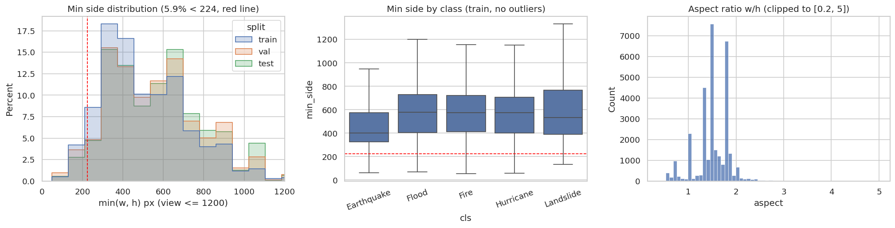
*圖 2-7：影像最短邊分布（僅 5.9% < 224px，紅線）、逐類最短邊 box、長寬比分布。多數影像短邊 > 256px，支持 Resize(288)→CenterCrop(256) 的前處理選擇。*

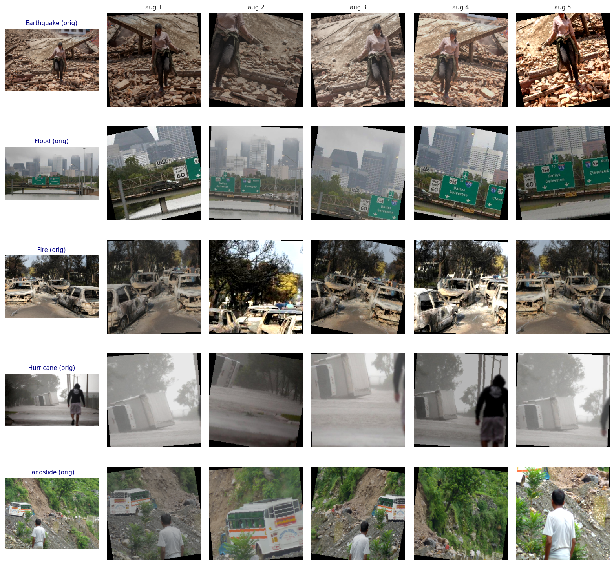
*圖 2-8：訓練資料增強預覽（各類 orig + 5 種增強）。RandomResizedCrop + 水平翻轉 + ColorJitter + 旋轉，提升對拍攝角度/光線變化的穩健性。*

### 2.8 Security controls（資料面安全控制）

| 控制 | 說明 |
|---|---|
| 來源驗證 | 訓練資料為固定、版本控管的學術資料集（MEDIC），非動態可寫入儲存，降低 training-time data poisoning 風險 |
| 不受信任輸入 | 生產資料（民眾上傳）視為**不受信任輸入**，先經 ShieldGemma 影像/輸入安全檢查（§6）才進入推論 |
| 訓練/生產隔離 | 目前**生產回報資料不直接用於再訓練**；若未來啟用 user-data 再訓練，需加入 poisoning 檢查與審核（§9） |
| 存取控制 | 影像 admin-only；密碼 PBKDF2-SHA256（120,000 iters）+ salt（`utils/auth.py`） |
| 儲存 | Azure Blob 或本機 `uploads/reports/`，JPEG q85（`utils/storage.py`） |
| 限速 | 每使用者每小時最多 10 筆回報（`app.py`，`_RATE_LIMIT = 10`），抑制自動化灌入 |

> **資料卡小結**：訓練資料偏誤（地理/類別不平衡/Hurricane≠Typhoon）是主要品質風險，已以選模指標與增強部分緩解；生產資料的主要風險是隱私（GPS/PII）與不受信任輸入，已以 `strip_exif` + H3 模糊化 + ShieldGemma + 限速控制。

---

## 3. Model Card

> 採課程 Model Card 9 段模板。CrisisLens 的分類核心是**雙主投票**：CLIP（第一主）+ EfficientNet-B0（第二主）。CLIP 本身有兩條路徑（linear-probe 優先、zero-shot 退路）。

### 3.1 Model identity（模型識別）

| 模型 | 演算法 | 版本 | 權重 / 入口 |
|---|---|---|---|
| CLIP（第一主） | ViT-L/14，linear-probe 優先 / zero-shot 退路 | `clip-vitl14-v1` · `linear-probe-medic-6to5-v1` · `multi-prompt-avg-5class-v2` | `models/clip_linear_head.pth`；`classify_clip()` |
| EfficientNet-B0（第二主） | CNN，MEDIC 5 類微調 | `efficientnet-b0-medic-5class-v2` | `models/efficientnet_b0_5class_v2.pth` |
| DisasterCNN_v1（legacy） | 自訓 4-block CNN（~400K params） | `custom-cnn-medic-5class-v2` | 已從投票淘汰 |
| ResNet50（legacy） | baseline linear probe | — | 已淘汰 |

### 3.2 Intended use（預期用途）

- **核准使用者**：民眾回報端、admin 審核端。
- **決策情境**：將災情影像分類為 5 類，作為應變建議與事件聚合的**輔助情報**。
- **禁止用途**：不得作為自動派遣/資源調度的唯一依據；不得取代官方災害判定；不得商業化（MEDIC 授權限制）。

### 3.3 Training data（訓練資料）

- QCRI/MEDIC 5 類 v2（詳見 §2）：train 23,075 / val 2,672 / test 5,649；已去重（−3,616）與測試集洩漏排除（−60）。
- 目標：5 類災害的單標籤分類。EfficientNet 前處理 Resize(288)→CenterCrop(256) + ImageNet normalize。

### 3.4 Performance（效能）

**EfficientNet-B0（test，`docs/phase_b_state.md`）：test macro-F1 = 0.8375**

| 類別 | Recall | 備註 |
|---|---|---|
| 地震 Earthquake | 0.862 | |
| 淹水 Flood | 0.877 | |
| 火災 Fire | 0.894 | 最佳 |
| 颱風 Typhoon | **0.783** | 最弱（Hurricane≠Typhoon 分布偏移） |
| 土石流 Landslide | 0.843 | **precision 0.694 偏低**（易誤判入此類） |

- **雙主投票機制**：兩模型一致 → 高信心；不一致 → `model_agreement=0` 且 `need_review=1`，primary 取信心較高者。
- Legacy 對照：DisasterCNN_v1 test macro-F1 **0.7012**（test acc 0.717）< EfficientNet（macro-F1 0.8375、test acc 0.847），故淘汰。

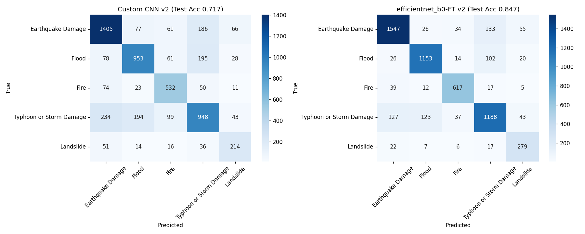
*圖 3-1：5 類測試集混淆矩陣。左為 Custom CNN v2（Test Acc 0.717），右為 EfficientNet-B0-FT v2（Test Acc 0.847）。EfficientNet 對角顯著更強；颱風（Typhoon）列仍有 127 誤判為地震、123 誤判為淹水，與 §2 EDA 階段 kNN 基線中颱風為最弱類（圖 2-4）一致。*

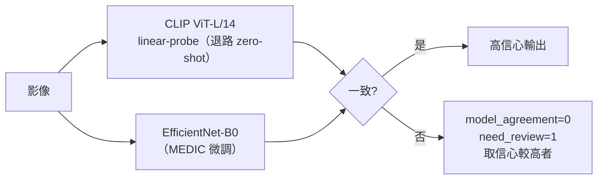

### 3.5 Fairness & XAI（公平性與可解釋性）

- **公平性（slice）**：無人口受保護屬性，改以**逐類別 recall** 作為 slice 公平性指標。目前 slice 不均：颱風 recall 0.783 最弱、Landslide precision 0.694 偏低 → 對策為增樣/重採樣與颱風在地資料補強（§9）。
#### 可解釋性（XAI）— 方法論與實作規劃

依課程 Fairness/XAI add-on（Slides 7–10），XAI 在 MLSecOps 中是「**控制證據**」，分兩種範圍、兩種方法，並作為安全訊號使用：

- **Local**：解釋單一決策（「這張為何被判為 X？」）→ 供申訴、admin 人工審核、案件稽核。
- **Global**：解釋整體行為（「哪些特徵驅動各類？」）→ 供模型驗證、proxy 偵測、feature leakage 檢查、drift 監控。
- **安全訊號**：XAI 可揭露 proxy 特徵、label leakage、對不穩定資料的過度依賴、retraining 後的異常 drift、對抗/poison pattern。

課程在 tabular（貸款）用 **SHAP**（加性 Shapley 貢獻，`prediction = baseline + Σ feature 貢獻`）與 **LIME**（局部擾動 + 線性代理）。CrisisLens 是**影像模型**，須把這套對應到視覺歸因方法：

**(1) 課程 tabular 方法 → CrisisLens 視覺方法對應**

| 課程方法（tabular） | CrisisLens 視覺對應 | 適用模型 | 揭示什麼 |
|---|---|---|---|
| SHAP global summary | 逐類 Grad-CAM 熱區彙整、影像統計特徵的 SHAP（DeepSHAP / GradientSHAP） | EfficientNet | 哪些區域/紋理系統性驅動各類 |
| SHAP/LIME local | 單張 Grad-CAM / Integrated Gradients / occlusion sensitivity | EfficientNet | 這張影像哪塊像素支持該預測 |
| LIME local surrogate | 影像版 LIME（superpixel 分割 → 擾動 → 線性代理） | 任意黑箱（含 EfficientNet） | 哪些 superpixel 支持/反對該類 |
| （CLIP 特有，無 tabular 對應） | 各 prompt 的 image-text cosine 相似度、CLIP 相似度顯著圖 | CLIP | 哪條文字描述最匹配、語意依據 |

**(2) 具體做法（依課程 measure → diagnose → mitigate → validate → document 流程）**

1. **Local**：對每筆 `need_review` 案件，產生 EfficientNet Grad-CAM 熱圖 + CLIP 各 prompt 相似度，附在 admin 審核介面（對應課程「local explanation 供 manual review / case audit」）。
2. **Global**：對測試集逐類彙整 Grad-CAM 熱區找系統性依賴；對影像亮度/色彩等統計特徵（見 §2 EDA）做 SHAP summary，檢查 proxy 與 leakage。
3. **安全訊號（重點）**：用 Grad-CAM / occlusion 檢查 §2 EDA 發現的雜訊樣本（圖 2-5 的政治迷因、"PRAY FOR OREGON" 文字卡）——**模型是否依賴影像上的文字疊圖而非災害場景本身？** 若是，即為 spurious correlation / 資料中毒弱點，須回到資料清理（diagnose→mitigate）。亦用於偵測對抗 pattern 與 retraining 後的 attention drift。
4. **版本化**：依課程對 LIME「不穩、須對重要案件版本化並可重複」的提醒，解釋結果隨模型版本記錄（連動 `model_runs`）。
5. **交付物（對齊 Workshop 提交清單）**：SHAP global summary + 每類一張 local Grad-CAM/LIME（至少含一筆 `need_review` 案例），並輔以文字討論。

**(3) 現況 vs 規劃**

| 狀態 | 內容 |
|---|---|
| 已實作 | CLIP 各 prompt 的 image-text 相似度 → Top-3 + 信心條（UI）；雙主投票一致性作為「決策信賴度」訊號。屬 inherent、coarse 的解釋。 |
| 未實作（→ §9 未來工作） | Grad-CAM / Integrated Gradients / 影像 LIME / 影像 SHAP；global 熱區彙整；以 XAI 檢查文字疊圖依賴的安全訊號流程。 |

### 3.6 Security testing（安全測試）

- **固有對抗韌性**：CLIP（ViT）與 EfficientNet（CNN）架構與訓練目標獨立，單一對抗擾動難同時騙過兩者；不一致即觸發 `need_review`。
- **供應鏈**：權重載入採 `torch.load(weights_only=True)`（CLIP/EfficientNet/CustomCNN）防止反序列化任意程式碼；**已知缺口**：`models/resnet_baseline.py` 未加 `weights_only`（§6、§9）。
- **缺口**：尚未做正式 FGSM/PGD 對抗測試與 data poisoning 測試 → 未來工作。完整威脅模型見 §6。

### 3.7 Limitations & residual risk（限制與殘餘風險）

| 限制 | 說明 |
|---|---|
| Temperature 校準不符 | linear-probe temperature **0.3814** 為舊 6 類校準，切至 5 類為近似，會放大信心 |
| 投票互補性下降 | linear-probe 取代 zero-shot 後，CLIP 與 EfficientNet 皆為監督式 → 錯誤相關性升高，`need_review` 對信心/gap 的攔截變弱（主要靠模型不一致） |
| 無新 5 類驗證 | linear-probe 沿用舊 head 切片，未以新 5 類資料重新驗證 |
| 類別弱點 | 颱風 recall 0.783、Landslide precision 0.694 |
| 領域偏移 | 訓練以西半球事件為主，台灣場景準確率可能下降 |

### 3.8 Deployment & monitoring（部署與監控）

- **need_review 觸發**：`confidence < 0.50` 或 `Top1−Top2 gap < 0.15` 或 `model_agreement == 0`（`utils/versions.py`、`app.py`）。
- **Retraining 觸發**：`need_review` 率 > 30%（連續 100 筆）或 model agreement < 60%（持續 7 天）。
- **監控**：`model_runs` 表記錄各模型版本 + `inference_latency_ms`；MLOps 儀表板追蹤延遲、信心 drift、人工修正率（§7）。
- **Rollback**：權重版本化；linear-probe 載入失敗自動退回 zero-shot，模型選單亦可手動切回。

### 3.9 Approval gate（上線審核閘）

對應課程 deploy / improve / block：

| 判準 | CrisisLens 現況 |
|---|---|
| 效能門檻 | EfficientNet macro-F1 0.8375 ≫ legacy CNN 0.7012 → **deploy** |
| 模型一致性 | 雙主投票 + `need_review` 攔截可疑樣本 |
| 安全控制 | ShieldGemma 三檢查點 + weights_only + 限速（§6） |
| 監控擁有者 | admin 負責審核與監控 |
| 殘餘風險 | linear-probe 校準近似 → 以「保留 zero-shot 退路 + 可 A/B」作為 **improve** 配套，未硬性 block |

> **模型卡小結**：EfficientNet-B0（0.8375）為效能主力，CLIP 提供語意互補與 zero-shot 退路。最大殘餘風險是 linear-probe 的校準近似與颱風/土石流類弱點，均有監控與未來工作對應。

---

## 4. Prompt Card

> CrisisLens 有兩組 prompt：**CLIP 分類 prompt** 與 **RAG 應變建議 prompt**。本卡記錄其設計、版本與注入風險面。

### 4.1 Prompt 識別與版本

| Prompt | 用途 | 版本 | 來源 |
|---|---|---|---|
| CLIP 分類 prompt | zero-shot 多描述分類 | `multi-prompt-avg-5class-v2` | `utils/config.py` |
| RAG 應變建議 prompt | 生成在地化應變建議 | `gemini-flash-rag-v1` | `rag/prompts.py` |
| 生成模型 | — | Gemini 2.5 Flash | `rag/generator.py` |

### 4.2 CLIP 分類 prompt

- **PROMPT_SETS**：三組（A 簡短版 / B 完整句版 / C 社群情境版），各 5 條對應 5 類，供單 prompt 比較。
- **MULTI_PROMPT_SETS**（主要）：每類 3–7 條多描述（Earthquake 7、Flood 4、Fire 4、Typhoon 4、Landslide 5）。zero-shot 路徑取各類多條 prompt 的**平均 cosine 相似度**再 ×100 softmax。
- **範例（Earthquake 節錄）**：`"a photo of earthquake damage with collapsed buildings"`、`"a building that collapsed due to earthquake"`、`"a road cracked and broken by an earthquake"`。
- **動態 prompt**：設計支援 Gemini 生成的 `utils/prompts_generated.json`（每類 ≥3 條才採用，否則回退內建）；**目前未生成 → 使用內建 MULTI_PROMPT_SETS**（`_load_active_multi_prompts()`）。
- **設計理由**：多描述平均可降低單一 prompt 措辭的敏感度，使 zero-shot 輸出更穩定。

### 4.3 RAG 應變建議 prompt

- **`RAG_SYSTEM_PROMPT`**：角色＝台灣災害應變專家助理；要求輸出 3–5 條「・」開頭的可執行建議 + 來源說明。
- **`RAG_USER_TEMPLATE`**：注入 `context`（FAISS 檢索的 SOP 片段）、`disaster_type`、`confidence`、`user_description`、`location`。
- **檢索**：FAISS Flat L2 + `paraphrase-multilingual-MiniLM-L12-v2`，6 份 SOP（地震/淹水/火災/颱風/土石流/emergency），chunk 400 / overlap 80，zh-TW。
- **Fallback**：LLM/RAG 不可用時改用 `FALLBACK_ADVICE`（按 5 類靜態建議）或 `GENERIC_FALLBACK_ADVICE`。

### 4.4 Prompt 注入風險面與控制

- **風險**：`user_description` 為使用者可控文字，會被串入 RAG prompt 的 context → **間接 prompt injection**（對應 OWASP LLM01）。
- **控制**：
  - ShieldGemma 輸入檢查（keyword → 本機 ShieldGemma → Gemini，P>0.7 block / >0.4 review）攔截已知注入 pattern。
  - 結構化模板：`user_description` 以明確標籤欄位（「使用者描述：…」）插入，與 SOP context、disaster_type 分隔；**註：目前尚未做專用 XML/delimiter 隔離塊（規劃中，見 §6）**。
  - 輸出檢查：`check_rag_output` 對建議做安全檢查，不安全則 sanitize 或退回靜態 fallback。
  - 限速 10 筆/小時抑制自動化注入。
  - 完整威脅分析見 §6。

### 4.5 版本治理

- `CLIP_PROMPT_VERSION` / `RAG_PROMPT_VERSION` 寫入 `model_runs`；CLIP 走 linear-probe 時改記 `CLIP_PROBE_VERSION`（§7）。Prompt 任何修改皆遞增版號以利稽核與 drift 追蹤。

---

## 5. 可信度測試（TEVV）

> 依課程 TEVV 六面向（AI Security Deck, Slide 11）：**Performance / Fairness / Explainability / Robustness / Privacy / Security**。課程原則：Go/No-Go = 技術指標 + 可信度指標 + 殘餘風險核准。

### 5.1 Performance（效能）

- EfficientNet test macro-F1 **0.8375**（acc 0.847）；雙主投票提供互補（§3.4，圖 3-1）。

### 5.2 Fairness（slice 公平性，非人口屬性）

- CrisisLens 無人口 protected attribute → 以**類別 / 地區 / 時段** slice 取代 SPD/DI。
- 逐類 recall 落差為主要不均：颱風 0.783 最弱、Landslide precision 0.694（§3.4）；三 split 類別占比一致（圖 2-2）。
- 對策：颱風在地資料補強、重採樣、門檻調整（§9）。

### 5.3 Explainability（可解釋性）

- **方法論與實作規劃完整見 §3.5**（local/global 範圍、SHAP/LIME→Grad-CAM/影像LIME 對應、5 步做法、XAI 作為安全訊號）。
- 現況：CLIP per-prompt 相似度 + Top-3 + 信心條 + 雙主一致性（coarse）；缺口：Grad-CAM / Integrated Gradients / 影像 SHAP（§9）。

### 5.4 Robustness（穩健性）

- **風險**：對抗樣本（FGSM/PGD，§6）、低光/遮蔽、影像壓縮、OOD（台灣場景偏移）、**文字疊圖 spurious correlation**（圖 2-5 的迷因/字卡）。
- **現況**：資料增強（旋轉/翻轉/ColorJitter，圖 2-8）提供基本擾動韌性；雙主投票（ViT vs CNN）提高「同時被騙」難度。
- **缺口**：未做正式 FGSM/PGD/AutoAttack、OOD、image-corruption 測試 → §9。

### 5.5 Privacy（隱私）

- `strip_exif` 移除 GPS/EXIF；H3 res 9（~174m）模糊化；不做人臉辨識；ShieldGemma 對身分證/手機/精確地址標 review；影像 admin-only + JPEG q85；限速。詳見 §2.5、§6。
- **缺口**：無自動資料保留/刪除政策（§9）；GDPR Art.4(1) 視位置為個資（§6）。

### 5.6 Security（安全）

- 完整威脅模型見 **§6**（七層防禦、對抗 / RAG poisoning / prompt injection / EXIF 洩漏、`weights_only`、MITRE ATLAS / OWASP LLM Top 10 對應）。

### 5.7 TEVV 總結

| 面向 | 現況 | 證據 | 缺口 |
|---|---|---|---|
| Performance | macro-F1 0.8375 | §3.4、圖 3-1 | 颱風/土石流類弱點 |
| Fairness（slice） | 逐類/split 分析 | §3.4、圖 2-2/2-4 | 無正式 slice-by-region 監控 |
| Explainability | coarse（相似度/Top-3/一致性） | §3.5 | Grad-CAM/SHAP 未實作 |
| Robustness | 增強 + 雙主投票 | 圖 2-8、§3.6 | 無正式對抗/OOD 測試 |
| Privacy | strip_exif + H3 + ShieldGemma | §2.5 | 無保留/刪除政策 |
| Security | 七層防禦 + 護欄 | §6 | 無正式紅隊測試 |

---
