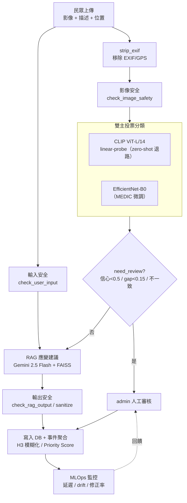

# CrisisLens — MLSecOps 期末報告

> **課程**：MLSecOps（AI Security & Safety）
> **專案**：CrisisLens v2.1 — 災情圖文分類與應變建議平台
> **作者**：CrisisLens 專案團隊
> **日期**：2026-06-13

---

## 摘要

CrisisLens 是一套面向災害情境的 AI 平台：民眾上傳災情照片與文字描述，系統以**雙主投票**（CLIP ViT-L/14 linear-probe 與 EfficientNet-B0）將影像分類為 5 類災害，再透過 **RAG（Gemini 2.5 Flash）** 產生在地化應變建議，最後寫入資料庫並做事件聚合與即時監控。由於系統處理公民提交的影像、產生攸關公共安全的建議，本報告以 **MLSecOps 證據包**的形式，完整記錄其資料治理、模型治理、可信度、威脅模型、監控與合規對應。

本報告刻意對齊課程的期末交付包清單，逐項提供可稽核的證據：

| 課程交付物 | 對應章節 |
|---|---|
| AI Use Case Canvas | §1 系統概述 |
| **Data Card** | §2 |
| **Model Card** | §3 |
| **Prompt Card** | §4 |
| Trustworthiness（TEVV） | §5 |
| **Threat Model** | §6 |
| Test Report（監控 / 部署 Gate） | §7 |
| **Compliance Mapping** | §8 |
| 殘餘風險與反思 | §9 |

> 本系統同時涵蓋課程 Workshop 2（隱私保護的視覺安全偵測）與 Workshop 3（企業 RAG 助理）的特性：它既是一個視覺安全事件偵測系統，也是一個帶安全護欄的 RAG 應變助理。

---

## 目錄

1. [系統概述 / AI Use Case Canvas](#1-系統概述--ai-use-case-canvas)
2. [Data Card](#2-data-card)
3. [Model Card](#3-model-card)
4. [Prompt Card](#4-prompt-card)
5. [可信度測試（TEVV）](#5-可信度測試tevv)
6. [威脅模型與資安（Threat Model）](#6-威脅模型與資安threat-model)
7. [MLOps 監控與部署 Gate（Test Report）](#7-mlops-監控與部署-gatetest-report)
8. [合規對應（Compliance Mapping）](#8-合規對應compliance-mapping)
9. [殘餘風險與反思](#9-殘餘風險與反思)

---

## 1. 系統概述 / AI Use Case Canvas

### 1.1 AI Use Case Canvas

| 欄位 | 內容 |
|---|---|
| **問題 / 動機** | 災害發生時，分散的民眾目擊資訊難以即時彙整、分類與分級，影響應變調度。CrisisLens 以 AI 將「一張照片 + 一句描述」轉為「已分類、已分級、附應變建議」的結構化情報。 |
| **主要使用者** | (1) 民眾回報端：上傳災情影像、文字、位置；(2) 管理端（admin）：在儀表板審核、修正、調度，並監控模型效能。 |
| **AI 決策情境** | 影像 → 5 類災害分類（雙主投票）→ 信心/一致性評估 → RAG 應變建議。AI 輸出為**輔助情報**，非自動指揮。 |
| **人類監督（Human-in-the-loop）** | 低信心、模型不一致或模糊樣本標記 `need_review = 1`，進入 admin 人工審核；admin 可修正分類，修正回饋進入 MLOps 追蹤。最終裁量權保留於人。 |
| **風險分級** | 中高風險：輸出影響公共安全與應變資源配置；錯誤分類或誤導建議可能延誤救援。故全程採人類監督 + 安全護欄 + 免責聲明。 |
| **範圍（In-scope）** | 5 類災害影像分類、應變建議生成、事件聚合與優先級、安全/隱私護欄、效能監控。 |
| **非目標（Out-of-scope）** | 不做人臉辨識、不做自動派遣決策、不取代官方災害判定（輸出標示「僅供初步參考，不代表官方災害判定」）。 |
| **成功指標** | 分類 macro-F1（目前 EfficientNet 0.8375）、需審核樣本能被正確攔截、應變建議安全且在地化、端到端延遲可監控。 |

### 1.2 ML 生命週期與各階段控制

CrisisLens 以「每個階段都產生證據與控制」的 MLSecOps 思維貫穿生命週期：

### 1.3 端到端系統架構

下圖為單次回報的執行流程，安全護欄（ShieldGemma）包夾在輸入與輸出兩端，分類採雙主投票，低信心/不一致進入人工審核：

### 1.4 技術組成一覽

| 層 | 元件 | 版本 / 模型 |
|---|---|---|
| 分類（第一主） | CLIP ViT-L/14（linear-probe 優先，zero-shot 退路） | `clip-vitl14-v1` / `linear-probe-medic-6to5-v1` / `multi-prompt-avg-5class-v2` |
| 分類（第二主） | EfficientNet-B0（MEDIC 5 類微調） | `efficientnet-b0-medic-5class-v2`（test macro-F1 0.8375） |
| 應變建議 | RAG：FAISS + MiniLM 檢索 + Gemini 2.5 Flash | `faiss-multilingual-minilm-v1` / `gemini-flash-rag-v1` |
| 安全護欄 | ShieldGemma 三檢查點（輸入 / 影像 / 輸出） | keyword → 本機 ShieldGemma → Gemini |
| 聚合與分級 | H3 (res 9) 事件聚合 + Priority Score | `disaster-group-distance-timewindow-v4` / `svcp-weighted-v2` |
| 監控 | MLOps 儀表板（`model_runs` + `inference_latency_ms`） | — |
| Legacy（已淘汰） | DisasterCNN_v1（0.7012）、ResNet50 baseline | `custom-cnn-medic-5class-v2` |

---
